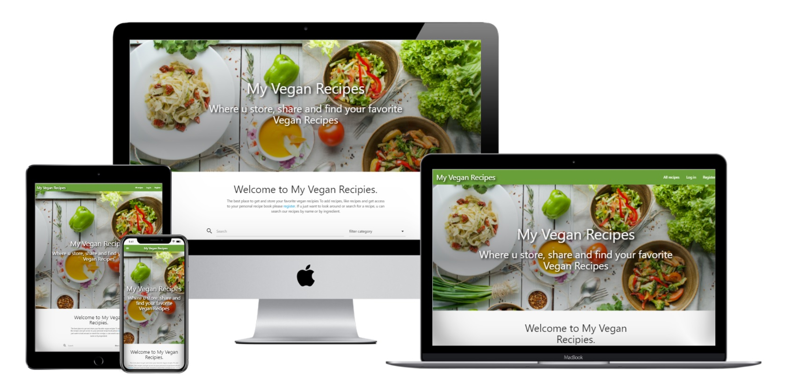
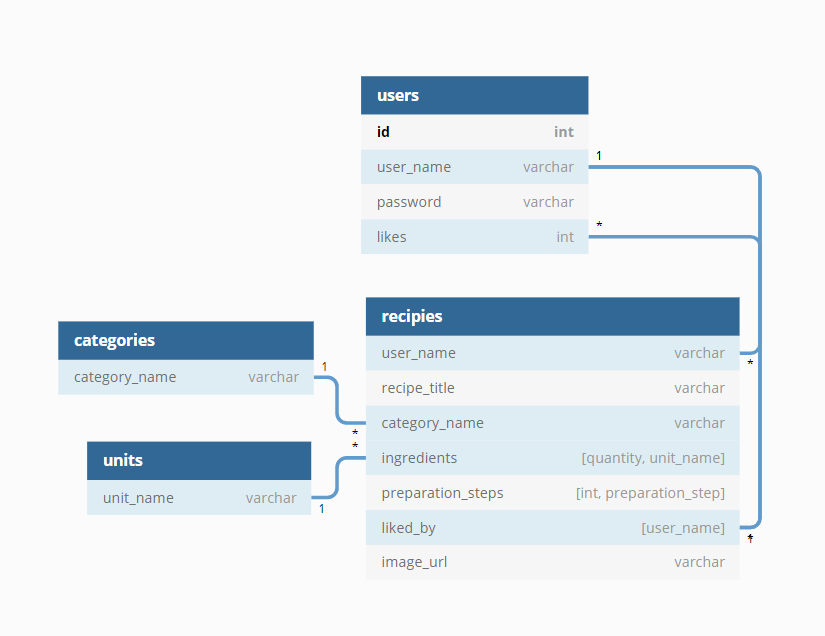
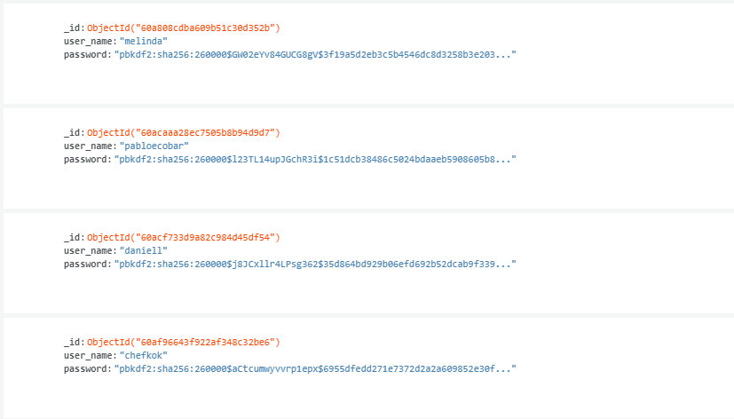
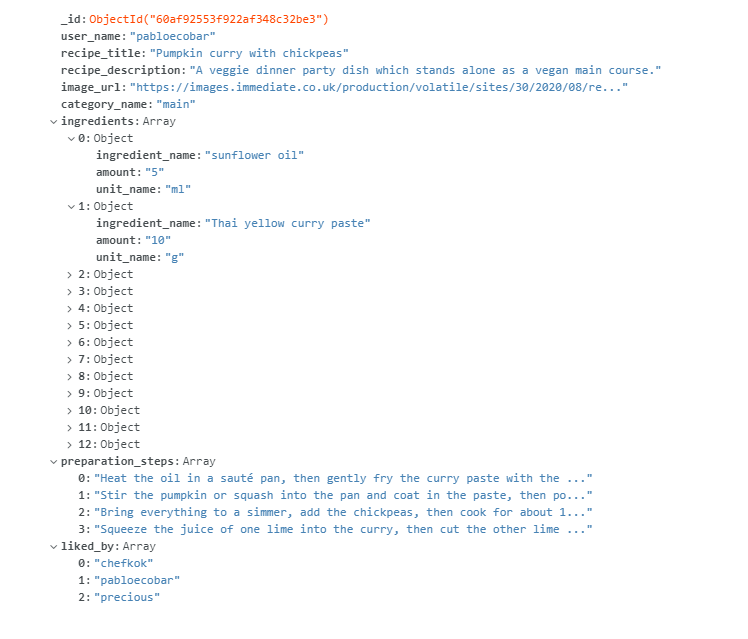
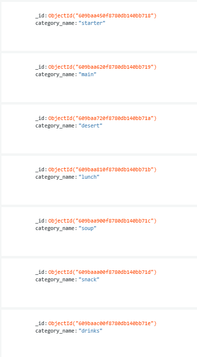
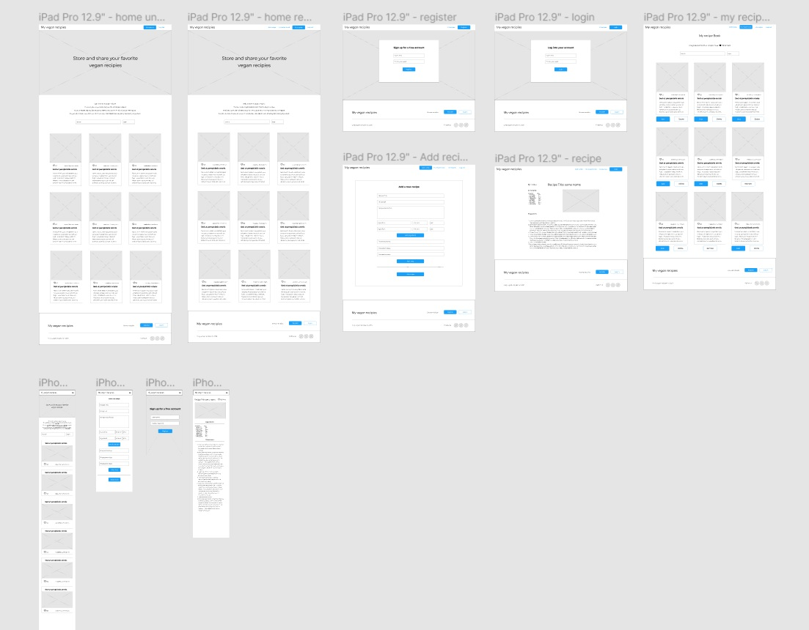
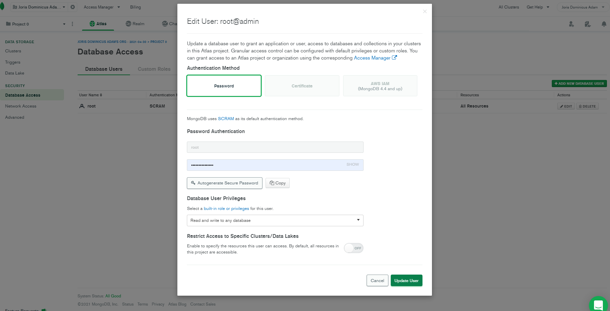
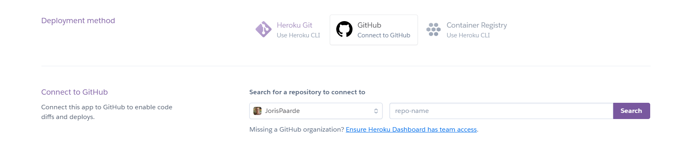
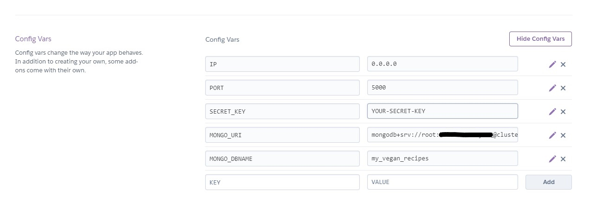

# MY Vegan Recipes

## Where u store, share and find your favorite Vegan Recipes

My Vegan recipes is a recipe website where u can store and share your favorite vegan recipes.
It gives u a personal recipe book where all your favorites are easily accessible. U can find and like recipes added by other users, and recieve likes on the recipes u added yourself.
We invite u to start adding your favorite recipes and start collecting those likes.

[View the live project here](https://my-veganrecipes.herokuapp.com/)



# Table of Contents

- [UX](#user-experience-(ux))
  - [User stories](#user-stories)
  - [Design](#design)
  - [Mockup](#mockup)
- [Features](#features)
- [Technologies Used](#technologies-used)
- [Testing](#testing)
- [Deployment](#deployment-and-cloning)
- [Credits](#credits)

# User experience (ux)

## User stories:

### First time user:

As a first time user i want to:

- Have a clear idea what the site is about.
- Register as a new user
- View recipies other people posted
- See most liked recipies on top
- Read a full recipe
- See which recipes i liked (needs registration)
- Search: - recipies by ingredient
          - by name
- filter by category (dropdown)
- like a recipe (only one like per user per recipe, needs registration)

### Recurring user:

- See how many likes my recipies have in total.
- See how many likes my individual recipies have.
- See which recipes i liked
- Log into my personal recipe book.
- Add my own recipies
        - title
        - category
        - image url
        - description
        - ingredients by name, amount and unit(dropdown selection)
        - preparation steps (adding 1 step at a time)
        
- Edit my own recipies.
        - edit inputs
        - delete inputs
        - add inputs
- Delete my own recipies.
- Add recipies from other users to my personal recipe book
- Remove recipies from other users from my personal recipe book
- Filter my personal recipe book by category (dropdown)
- Search my personal recipe book by ingredients and/or title

# Design


## Colour Scheme

As the base colors for this site, green seemed obvious.
Green for a site with recipes with lots of greens...
Knowing that a lot of colorfull recipe pictures where on display also, no other colors were used to keep the design clean.
For readability the rest of the site has a simple white background and black / grey text.

Some elaboration on the color green:

source: https://zevendesign.com/color-association/#green
#### GREEN:
Spring, the macabre, **freshness**, mystery, envy, hope, eternal life. Being composed of yellow and blue, green presents the feeling of light and coolness, cheer and restraint. It is the **color of nature** as usually seen. Green **alleviates tension** and **implies restfulness**.

#### Emotional Response:
Green supposedly has **healing power**. It is the **most restful color for the human eye**; it can improve vision. Green suggests stability and endurance. Sometimes green denotes lack of experience; for example, a ‘greenhorn’ is a novice. In heraldry, green indicates growth and hope. Green, as opposed to red, **means safety**; it is the color of free passage in road traffic.

#### Use in Design & Advertising:
Green is used to indicate safety when advertising drugs and medical products. Green is directly **related to nature**, so is **used to promote ‘green’ or natural products**. Dull, darker green is associated with money, the financial world, banking, Wall Street.

### Fonts
The site uses the default values by materialize css.

"Defaulting to the system font of a particular operating system can boost performance because the browser doesn’t have to download any font files, it’s using one it already had. That’s true of any “web safe” font, though. The beauty of “system” fonts is that it matches what the current OS uses, so it can be a comfortable look."
source: https://css-tricks.com/snippets/css/system-font-stack/


## Database schema

### Original database design:

This original desing was made in dbdiagram, and can be acessed via this [link](https://dbdiagram.io/d/609b830ab29a09603d147ffc)


During development the units were dropped as generating the dropdown from the database caused conflicts when adding an ingredient line.
The likes in the users document turned out not to be necessary for functionality.

### Database in mongo db:

User data:

Recipe example:

Categories:


## Imagery

Apart from the images linked in the recipes, the following images where used:

-   https://unsplash.com/photos/4MEL9XS-3JQ?utm_source=unsplash&utm_medium=referral&utm_content=creditShareLink
-   https://unsplash.com/photos/IxBCafdQItg?utm_source=unsplash&utm_medium=referral&utm_content=creditShareLink    


## Mockup

-  The mockup design of this site was made in Figma. U can view it [here](https://www.figma.com/file/wDLKFqlSfiIHY9t91UBkJX/My-vegan-recipies?node-id=0%3A1) 



# Features

- Flash messages for user feedback.
- Register form with javascript validation and username check to database to prevent doubles.
- Password encryption in database with werkzeug security helper.
- Login form with automatic rederect and welcome message. Also blocks logged in user from acessing this page.
- Logout button with flash feedback message.
- Like button that lets users add a recipe to a private recipe book, prompts user to register if they are not logged in yet.
- Truncation on recipe cards, prevents long recipe titles from breaking the site layout.
- Delete recipes: Only available to the recipe owner. with confirmation modal.
- Edit recipes form with delete, add and update capabilities, again only accessable to a logged in user.
- Remove recipes: Removing a recipe from the personal cookbook, only available for recipes not owned by the user
- Search with regex on ingredients and titles: Search transforms the query to *.query.* and searches trough recipe titles and recipe ingredients. Optional recipe category search is also available
- Pagination on main page to keep site size managable
- Extensive custom modular javascript form validation
- Adaptive error display on validation. dynamically adjusts error text to let the user know exactly what to adress.
- Scroll to error on validation, so the user can easily adress it.
- Custom 404 and 500 error pages.

## future features

- Use Ajax to prevent page reloads on search and like functionality.
- Recipe reviews, so creators can get feedback on their recipes.
- List of top contributers on the main page.
- Email for retrieving a forgotten password.
- Product placements for vegan ingredients like beyond burger and other vegan products.
- Automatically generated shopping lists.
- Sharing recipes easily via socials or email.

# Technologies Used

### Languages Used

-   [HTML5](https://en.wikipedia.org/wiki/HTML5)
    - HTML5 was used to build the main structure and content of the page.
-   [CSS3](https://en.wikipedia.org/wiki/Cascading_Style_Sheets)
    - CSS3 was used to give the html styling and layout.
    And to make the page responsive to differentscreen sizes.
-   [Javascript](https://nl.wikipedia.org/wiki/JavaScript)
    - Javascript was used for all website altering functions, like adding and removing items in the various forms, and for custom validation.
-   [Python](https://www.python.org/)
    - Python was used for writing the scripts to render all the different templates using flask. And connecting to mongodb.
-   [Jinja](https://jinja.palletsprojects.com/en/3.0.x/)
    - Jinja was used for writing the template code.


### Frameworks, Libraries & Programs Used

1. [Materialize css 0.100.2:](http://archives.materializecss.com/0.100.2/getting-started.html)
    - Materialize was used to create the responsive structure of the website.
1. [Flask:](https://flask.palletsprojects.com/en/2.0.x/)
    - Flask was used to render various templates from the app.py file.
1. [Google Fonts:](https://fonts.google.com/)
    - Google fonts was used to import the icons and fonts for materialize.
1. [jQuery:](https://jquery.com/)
    - jQuery Used among other things in script file to initialze materialize scripts.
1. [Git](https://git-scm.com/)
    - Git was used for version control by utilizing the terminal in gitpod to regularly commit, with comments, to Git and Push to GitHub.
1. [GitHub:](https://github.com/)
    - GitHub is used to store the projects code and assets and to fork the project for the customer.
1. [Figma:](https://figma.com/)
    - Figma was used to create the website design and prototype.
1. [MongoDB:](https://www.mongodb.com/)
    - MongoDB was used to create the Database for the recipes, categories and user data.
1. [Heroku:](https://www.heroku.com)
    - Heroku was used to deploy the app.
1. [TinyPNG](https://tinypng.com/)
    - TinyPNG was used to compress images to ensure faster load times.
1. [dbdiagram](https://dbdiagram.io/)
    - To design the database schema.
1. [Werkzeug](https://werkzeug.palletsprojects.com/en/2.0.x/)
    - To encrypt the users passwords.

# Testing

All testing can be found [here](TESTING.md).

# Deployment and cloning

<<<<<<< HEAD
## To deploy this project: 
### follow the following steps:

- Create your account on MongoDB here: https://account.mongodb.com/account/register
- Create your account on Heroku here: https://signup.heroku.com/login


- ### Clone this repository:
### In linux:
To find the link, go to the "code" dropdown menu in this repository.
Click the clipboard icon next to the url.
In your terminal type:
=======
## Making a local clone:
In linux:
>>>>>>> f67525d4c7e5ad3c27413026e32317a89dd6d6a4

```
$mkdir <jour project directory>
$git init <jour project directory> (to set up a new repository)
$git clone https://github.com/JorisPaarde/my-vegan-recipes.git
```

In Windows:

follow [these](https://www.jcchouinard.com/clone-github-repository-on-windows/) steps.

Install all requirements through the requirements.txt file:
```
pip install -r requirements.txt
```

### Create your account for MongoDB here: https://account.mongodb.com/account/register

When u are logged in:

- Go to clusters and click create database.

- Enter your database name.

- As your first collection name enter users.

- Click the plus sign next to your new database name to add the collections recipes and categories.

- Insert the categories documents as shown in the [database design](#database-in-mongo-db)

Documents for users and recipes can then be added trough the site or directly in mongo db as shown in the database design.

Your database is now ready for use.

### Create your env.py file:
```
$touch env.py
```

Make sure u add this env.py file to your gitignore file!
Add the folowing code to your env.py file:

```python
import os

os.environ.setdefault("IP", "0.0.0.0")
os.environ.setdefault("PORT", "5000")
os.environ.setdefault("SECRET_KEY", "<YOUR-SECRET-KEY-HERE>")
os.environ.setdefault("MONGO_URI", "mongodb+srv://root:<MONODBPASSWORD>@cluster0.ajvr3.mongodb.net/<DATABASENAME>?retryWrites=true&w=majority")
os.environ.setdefault("MONGO_DBNAME", "<DATABASENAME>")
```
Replace YOUR-SECRET-KEY-HERE, MONGODBPASSWORD, DATABASENAME according to your personal situation.

### To retrieve your mongodb pasword: 

Go to database access, click edit and show password:



Your local clone is now ready for use.

## To deploy this project on Heroku: 

- Create your account on Heroku here: https://signup.heroku.com/login

- Create a new app on heroku:

- Go to: https://dashboard.heroku.com/apps
select new, create new app from the dropdown menu on the right.
Enter your app-name and region and click create app.
Under delpoyment method, select github.



- Select your repository and connect.

- Go to settings, config vars and enter the variables also located in your env.py file.



- Go to deploy and at the bottom of the page manually deploy your main github branch

Your app is now deployed and ready to run.
At the top of th epage click open app to run it.

# Credits

Special thanks to Sean, Johan and Igor for their tutoring help.
thanks to Precious for his mentoring.
And of course all the people on slack.

## recipes:

https://www.jamieoliver.com/recipes/category/special-diets/vegan/
https://www.goodhousekeeping.com/food-recipes/a38332/grilled-asparagus-and-shiitake-tacos-recipe/

## code: 

The following code was copied from external sources:

CSS for dotted line frame in recipe page:
https://github.com/lisa1Q84/somelikeithot-recipes/blob/master/static/css/style.css

Pagination:
https://gist.github.com/mozillazg/69fb40067ae6d80386e10e105e6803c9

The html select field added in the javascript code has no id since there will be multiple intances added.
