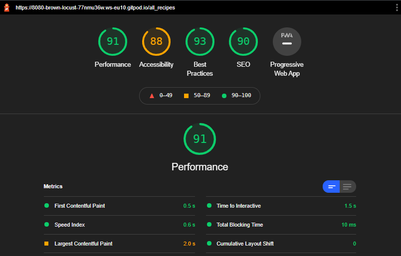

# Tests and bugreports:

- [User story testing](#user-story-testing)
- [Responsive layout testing](#responsive-visual-layout-testing)
- [Feature testing](#feature-testing)
- [Browser testing](#browser-testing)
- [Validators](#validators)
- [Lighthouse Report](#lighthouse-report)
- [Bugs during development](#bugs-encountered-during-development-and-their-fixes)

# User story testing:

## General functionality:

<br>
<br>

### As a First Time Visitor, I want to:
---
user story|implementation
----|----
Have a clear idea what the site is about. | The welcome text explains this in a few sentences.
Register as a new user. | Register page with custom validation.
View recipies other people posted. | shown at the bottom of the page.
See most liked recipies on top. | Recipes are sorted o show most liked on top.
Read a full recipe | Clicking a recipe card sends the user to the full recipe. The ability to do this is indicated by the hover shadow animation.
See which recipes i liked. (needs registration) | Indicated by the hart being filled in.
Search recipies by ingredient. | Search bar text field searches on any word containing the search query. ("fo" finds "foo" and "ofo")
Search recipies by title. | Search bar text field searches on any title containing the search query. ("fo" finds "foo" and "ofo")
filter recipes by category. (dropdown) | Dropdown menu next to the searchbar that works with or without text search.
Like a recipe. (only one like per user per recipe, needs registration) | clicking the hart icon does this and also automatically sends the user to his/her private recipe book.

<br>
<br>

### As a Returning Visitor, I want to:
---
user story|implementation
----|----
See how many likes my recipies have in total. | This is indicated at the top of the page of the users personal recipe book page.
See how many likes my individual recipies have. | indicate on each recipe card
See which recipes i liked | Indicated by the hart being filled in.
Log into my personal recipe book. | The login page is easily acesably via the main menu.
Add my own recipies | The add recipe link is automatically displayed when the user is logged in. In the header as well as the footer.
Add recipe title | Text field with custom validation to keep site content clean.
Add recipe category | Dropdown menu with validation.
Add an image url | Text field with custom validation to keep site content clean.
Add recipe description | Text field with custom validation to keep site content clean.
Add recipe ingredients by name, amount and unit(dropdown selection) | 3 fields, text, digit and dropdown with pre set units. And individual validation. this has been done to keep all ingredient lists the same format. Adding or deleting an ingredient line is done by the add button / trashcan symbol.
Add recipe preparation steps (adding 1 step at a time) |  Text field with custom validation to keep site content clean.
Edit my own recipies | Edit button only available for recipes made by the logged in user.
Edit recipe inputs | all fields are adjustable and show the current database values when editing a recipe.
Delete recipe inputs | The trashcan icon removes inputs. (after confirmation) Also a check is done to prevent recipes having no ingredients or preparation steps at all.
Add recipe inputs |
Delete my own recipies. | Delete button only available for recipes made by the logged in user.
Add recipies from other users to my personal recipe book. | Liking a recipe automatically adds it to your personal recipe book.
Remove recipies from other users from my personal recipe book. | Clicking the like icon of a liked recipe again (disliking) removes it. A remove button is automatically shown for recipes not created by the logged in user.
Filter my personal recipe book by category. (dropdown) | Dropdown menu next to the searchbar that works with or without text search.
Search my personal recipe book by ingredients and/or title. | Search bar text field searches both title and ingredients on any word containing the search query.

<br>
<br>

# Responsive visual layout testing

## Header

feature|expected behaviour|testing|result|Fix(if needed)
---|---|---|---|---
links | collapses to hamburger on mobile| Resized screen from large(width 1920px), down to small(width 280px).|collapses on 993px and smaller|
logo text | Stays readable on all screensizes | Resized screen from large(width 1920px), down to small(width 280px).|correct|
logo image| does not display on sizes smaller than 375px |Resized screen from large(width 1920px), down to small(width 280px).|correct|

<br>

## Footer

feature|expected behaviour|testing|result|Fix(if needed)
---|---|---|---|---
links| Stay readable on all screensizes and correctly display according to user logged in or not|Resized screen from large, down to small. Logged in and out.|Links stay readable, and are displayed correctly. User gets visual confirmation on being logged in/out.|
text| Stays readable on all screensizes
sticky|footer stays on the bottom of the page.|Resized screen from large, down to small.| footer did not stick to bottom of the page. | added correct css
````body {
    display: flex;
    min-height: 100vh;
    flex-direction: column;
  }

  main {
    flex: 1 0 auto;
  }
````

## recipe page
feature|expected behaviour|testing|result|Fix(if needed)
---|---|---|---|---
like button| displays in correct position and is not blocked by other content | Resized screen from large(width 1920px), down to small(width 280px).|correct|
ingredients section| Stays readable on all screensizes | Resized screen from large(width 1920px), down to small(width 280px).|correct|
preparation steps section| Stays readable on all screensizes | Resized screen from large(width 1920px), down to small(width 280px).|correct|
recipe image| displays in correct position and is not blocked by other content, is not blurred or deformed | Resized screen from large(width 1920px), down to small(width 280px).|correct|
<br>

## all recipe page
feature|expected behaviour|testing|result|Fix(if needed)
---|---|---|---|---
background image| displays in correct position and is not blocked by other content, is not blurred or deformed | Resized screen from large(width 1920px), down to small(width 280px).|correct|
welcome text| Stays readable on all screensizes | Resized screen from large(width 1920px), down to small(width 280px).|correct|
search bar| displays correctly on all screensizes | Resized screen from large(width 1920px), down to small(width 280px).|correct|
recipe cards|display correctly on all screensizes, images are not blurred or deformed, text is readable and in the correct position.| Resized screen from large(width 1920px), down to small(width 280px).|correct|
truncation| displays correctly on all screensizes | Resized screen from large(width 1920px), down to small(width 280px).|correct|
<br>

## recipe book page
feature|expected behaviour|testing|result|Fix(if needed)
---|---|---|---|---
background image| displays in correct position and is not blocked by other content, is not blurred or deformed | Resized screen from large(width 1920px), down to small(width 280px).|correct|
welcome text| Stays readable on all screensizes | Resized screen from large(width 1920px), down to small(width 280px).|correct|
search bar| displays correctly on all screensizes | Resized screen from large(width 1920px), down to small(width 280px).|correct|
recipe cards| display correctly on all screensizes, images are not blurred or deformed, text is readable and in the correct position.| Resized screen from large(width 1920px), down to small(width 280px).|correct|
<br>

## Register page
feature|expected behaviour|testing|result|Fix(if needed)
---|---|---|---|---
register text| Stays readable on all screensizes | Resized screen from large(width 1920px), down to small(width 280px).|correct|
form| displays correctly on all screensizes | Resized screen from large(width 1920px), down to small(width 280px).|correct|
<br>

## login page
feature|expected behaviour|testing|result|Fix(if needed)
---|---|---|---|---
login text| Stays readable on all screensizes | Resized screen from large(width 1920px), down to small(width 280px).|correct|
form| displays correctly on all screensizes | Resized screen from large(width 1920px), down to small(width 280px).|correct|
<br>

## add recipe page
feature|expected behaviour|testing|result|Fix(if needed)
---|---|---|---|---
form| displays correctly on all screensizes | Resized screen from large(width 1920px), down to small(width 280px).|correct|
<br>

## edit recipe page
feature|expected behaviour|testing|result|Fix(if needed)
---|---|---|---|---
form| displays correctly on all screensizes | Resized screen from large(width 1920px), down to small(width 280px).|correct|
<br>
<br>

# Feature testing

## Form validation

feature|expected behaviour|testing|result|Fix(if needed)
---|---|---|---|---
Title|Accepts length between 3 and 100 characters, must contain letters a-z and or A-Z | typed in: "   ", aZ, aaa, AAA, 101 chars ([a-z]and [A-Z]) and aaaZ| correct
Category|Required|submit without selecting this|correct
Url|Has to contain "https://"|typed in correct url containing "https://" and incorrect url containing "htps://" "https:/" "https//"| correct
Recipe description| Accepts length between 10 and 200 characters, must contain letters a-z and or A-Z| typed in: "   ", aaaaaaaaZ, aaaaaaaaa, AAAAAAAAA, 201 chars ([a-z]and [A-Z]) and aaaaaaaaaaZ| correct
Ingredient name|Accepts length between 3 and 100 characters, must contain letters a-z and or A-Z|  typed in: "   ", aZ, aaa, AAA, 101 chars ([a-z]and [A-Z]) and aaaZ| correct
Amount|Accepts length between 1 and 5 digits, must contain 0-9| typed in "123456",  "12.234", "asd", " ", "1234", "1"| correct
Preparation step|Accepts length between 10 and 400 characters, must contain letters a-z and or A-Z| typed in: "   ", aaaaaaaaZ, aaaaaaaaa, AAAAAAAAA, 401 chars ([a-z]and [A-Z]) and aaaaaaaaaaZ| correct
Username|Accepts length between 5 and 20 characters, that are not spaces. Also username should not already exist in database.| entered same username username and usernames with incorrect length, one with only spaces and a correct username.|correct
Password| Accepts length between 8 and 64 characters, Should include: lowercase letter, uppercase letter, number and special character. | entered passwords ommitting 1 of each character type in a password of correct length, passwords that include all but have an incorrect length, and a correct password.| correct
Adaptive error display on validation | Should display correct error and scroll to this error after submission of the form is blocked.|tested all validations|correct

<br>

## Other features

feature|expected behaviour|testing|result|Fix(if needed)
---|---|---|---|---
Flash messages|display messages like "u are logged out", "welcome {username}" etc. |logged in and out, liked a recipe. |all flash messages show correctly
Register|User can register an account and is added to the database, then rederected to his/her personal recipe book|registered with an accepted username and password and checked database|correct
Password encryption in database|user password is encrypted before being entered to the database, and decripted when logging in.|checked database entries|correct
Login|logging in with a correct password rederects the user to his/her recipe book and displays a welcome message. entering a false username and or password displays an error message via flash.|logged in with correct and incorrect username/password|correct
Logout|user is logged out, rederected to the all recipes page and recieves a confirmation message via flash|logged out|correct
Like button|Like button toggles, recipe is added/removed to/from the users recipe book and the user is rederected to his/her recipe book.|liked/disliked a recipe|correct
Truncation on recipe cards|cuts off text with ... when it does not fit its container|added verry long recipe title|correct
Edit recipes|opens the add recipe form with all data from the database, user has full functionality to edit the recipe and save it.|edited all fields, removed and added fields and saved the recipe. Checked database for correct update.|correct 
Delete recipes|removes a recipe from the database after confirmation in modal, only available to user that added the recipe|deleted a recipe, confirmed and cancelled, checked database state|correct
Remove recipes|removes a recipe from the users recipe book, but does not delete it. removes the like from the currently logged user. only available to users that did not add this recipe.|checked made by name to logged user, removed a recipe from a recipe book and checked database state.|correct
Search with regex on ingredients and titles | Results displayed correctly and search term displayed on screen. Also notification when no result is found.| searched several terms on all recipes page and recipe book page. | Searching in the all recipes page resulted in a 500 Internal Server Error. On the recipe book page all functioned as intended.| Caused by the calculated likes function wich uses the logged in user as an argument. Refactored code to only run this calculation on the recipe book site. Since this is only acessable when logged in.
Pagination
Scroll to error on validation
Custom 404 and 500 error pages|display custom pages for 404 and 500 error|entered a wrong url on the domain and tested search on the deployed heroku site.|both pages show correctly when they should|

<br>

# Browser testing

Browser|layout correct|functionality correct|Issues
---|---|---|---
Opera|Yes|Yes|None
Chrome|Yes|Yes|None
Edge|Yes|Yes|None
Firefox|Yes|Yes|None

<br>

# Validators

## To validate the html and CSS [W3C markup validation](https://validator.w3.org/) was used.

### base.html:
The response for the HTML had 32 errors wich were related to the jinja code in the html.

Exept this one:
Start tag body seen but an element of the same type was already open.
moved the body tag to include the nav tags to fix this.

### all-recipes.html:

Response after ignoring the jinja errors:
The element button must not appear as a descendant of the a element.
This would only be fixed if the card was not a link to a recipe. This error was ignored.

### edit_recipe.html:

Response after ignoring the jinja errors:
- Attribute type not allowed on element textarea at this point.
Removed the type attribute on the textareas.
- Duplicate attribute class.
Removed attribute and put all classes in one.
- The value of the for attribute of the label element must be the ID of a non-hidden form control.
These errors where on fields that will be duplicated many times trough javascript. wich would lead to errors with fields having duplicate id's. Added dynamically added labels and id's to fix this.

### recipe.html:


<br>

For the CSS the results were as follows:

Document checking completed. No errors or warnings to show.

<br>

## For Javascript validation [JSHint](https://jshint.com/) was used.

Results:


<br>

## For python validation [pep8online](http://pep8online.com/) was used.


<br>

# Lighthouse Report 

### main page on desktop:



<br>

# Bugs encountered during development and their fixes:

bug|fix
---|---
when adding an ingredient line with javascript, the dropdown menu did not work. | hardcoded in stead of db generated.
When liking a recipe without being logged in site crashed. | Check if logged user added. Rederected to register page.
When adding a really long title the text would flow outside the recipe card. | Fixed by adding webkit-line-clamp.
Card text displayed as blue link text when the card was made clickable to link to the recipe. | Added class to text.
Delete modal did not function. | Gave corresponding id to the modal for each recipe.
Background fixed caused exessive zoom on the background on apple devices. No errors on devtools.. | Finally used:@supports (-webkit-touch-callout: none). A hack to detect ios devices (they are the only ones supporting this.) and set the background to scroll.
When deleting the last ingredient or preperation step, adding a new one was broken. | Added a check to prevent deleting the last item.
Pressing reset on the search bar in the recipe book page sended the user to the all recipes page. | Corrected url.
Validation resulted in being valid if the last test was valid. | refactored code to fix it.
With validation on the dropdown menu's the scrollto would not work. | fixed by scrolling to the nearest row instead of the element itself.
Filling in a correct password was not accepted as valid. | Login validation was conflicting with html pattern, removed pattern from html.
Card created by text was breaking the card layout on certain screen sizes. | Decreased font size and adjusted created by text.
Delete button text disappeared on certain screen sizes. | Added custom css to this button.
Lighthouse testing revealed bad contrast and big image files. | Adjusted contrast and compressed images.
If a username was part of another username, likes would be calculated incorrectly. | Adjusted total likes function to only count likes if 'liked by' was exactly the same as logged in user.
